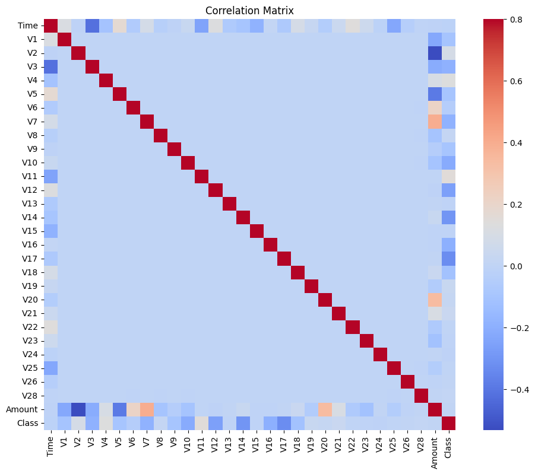
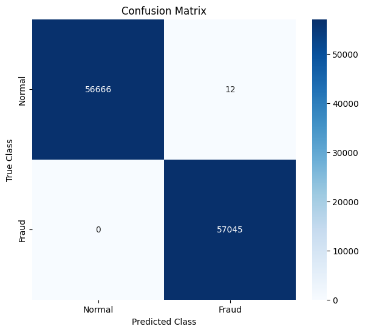

# Credit-Card-Fraud-Detection---ML

The goal of this project is to develop a machine learning model that can accurately detect fraudulent credit card transactions using historical data. By analyzing transaction patterns, the model should be able to distinguish between normal and fraudulent activity, helping financial institutions flag suspicious behavior early and reduce potential risks.

## Challenges include:

Handling imbalanced datasets where fraud cases are a small fraction of total transactions.
Ensuring high precision to minimize false positives (flagging a valid transaction as fraud).
Ensuring high recall to detect as many fraud cases as possible.

##

#
#

Fraud Cases: 492
Valid Transactions: 284307

##

#

#
#

Model Evaluation Metrics:
Accuracy: 0.9999
Precision: 0.9998
Recall: 1.0000
F1-Score: 0.9999
Matthews Correlation Coefficient: 0.9998

